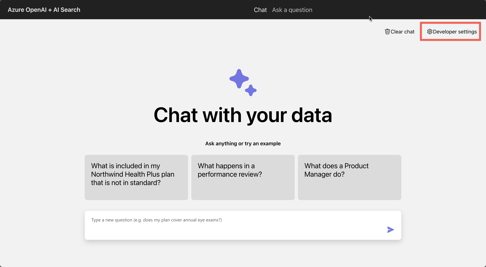

# Exercise 1: Explore Retrieval Modes

In this exercise, you will explore the different retrieval modes available in the app. Let's begin by exploring how different search configurations change the quality of answers.

## Step 1: Open the App in your Browser

1. From the previous set up exercise, you success fully deployed the app to Azure with the *azd up* command. You need to ensure that step completed successfully before proceeding with this exercise.

1. To verify that your deployment was successful, you should find a URL in the terminal that points to the deployed app. Use **CTRL + Click** on the URL to open the app in your browser or copy the URL and paste it into your browser.

    

## Step 2: Explore the Retrieval Modes

1. From the homepage, select **Developer Settings**, this opens a panel that allows you to experiment with different search and answer generation parameters.

    

1. In this panel, scroll down to the **Retrieval Mode** dropdown. Select **Vectors** from the dropdown. Close the panel ask the following question:

    +++*What is included in my Northwind Health Plus plan that is not in standard?*+++

    By applying the **Vectors** retrieval mode, the app will retrieve documents purely on semantic similarity. Note the quality of the answer and the relevance of the citations.

1. Next, switch the **Retrieval Mode** back to **Vectors + Text(Hybrid)**. Close the panel and ask the same question again:

    +++*What is included in my Northwind Health Plus plan that is not in standard?*+++

    By applying the **Hybrid** retrieval mode, the app will retrieve documents based on both semantic similarity (vector search) and keyword matching.
  
    Compare the two answers and note the differences. You will notice that the results have a stronger relevance and coverage.

## Next Step

> Select **Next >** to go to the next exercise on exploring semantic ranking in Azure AI Search.
