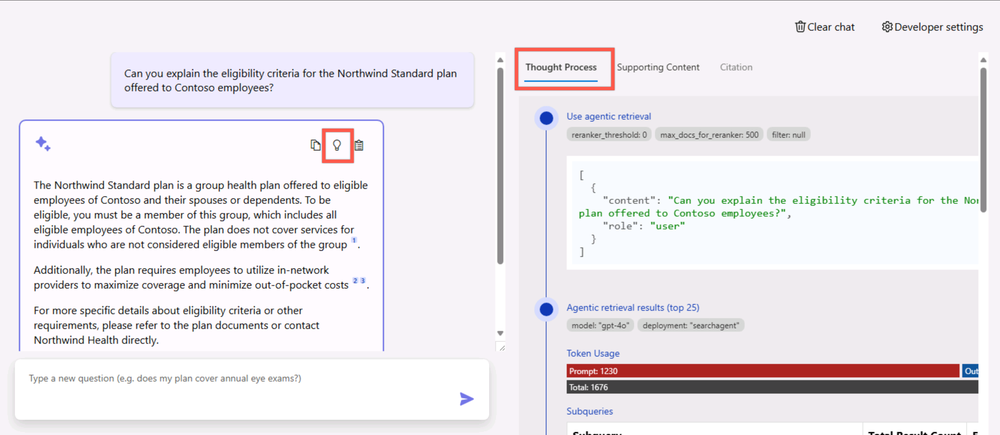

# Exercise 4: Enable Agentic Features

In this exercise, you will turn on features that allow the system to reason across multiple steps and refine its answers.

## Step 1: Enable Agentic Retrieval and Reflection

Run the following command in the terminal to redeploy the app with agentic features enabled:

+++*azd env set USE_AGENTIC_RETRIEVAL true*+++

+++*azd up*+++

This will take a few minutes to complete. You can monitor the progress in the terminal window.

Once complete you will see the endpoint url for the deployed app in the terminal. **CTRL + Click** the URL to open the app in your browser.

## Step 2: Test the App with Agentic Features

1. Once you have the app open in your browser, select **Developer Settings** from the top right corner of the app. Check the **Use agentic retrieval** checkbox and close the panel.

1. Use the same 5 questions you used in the previous exercise to test the app. You can ask the questions in any order.

    - +++Can you explain the eligibility criteria for the Northwind Standard plan offered to Contoso employees?+++
    - +++What are the financial implications of choosing an out-of-network provider under the Northwind Standard Benefits plans?+++
    - +++How does Northwind Health Plus manage coinsurance for virtual care services?+++
    - +++What's the impact of choosing in-network versus non-participating providers on your healthcare costs, and what are the exceptions to prior authorization that do not require prior approval?+++
    - +++What are the limitations of the Right of Recovery provision in the Northwind Health Plus plan?+++
    - +++What are the financial responsibilities of a Northwind Standard plan holder when using out-of-network providers?+++
    - +++Does Northwind Health cover full costs?+++

1. For each answer, observe the difference in the process used to generate the answer in the **Thought process** tab. Too open the **Thought process** tab, select the lightbulb icon in the answer.

    

1. Take note of the following:

    - Do the search results look different?
    - Does the RAG process take more steps than before?
    - Does the answer improve after reflection?

## Step 3: (Optional) Re-Run Automated Evaluation with Agentic Features

> [!TIP]
> Make sure to complete Exercise 3 before proceeding with this step.

Compare your answers before and after enabling agentic features manually first. You can log scores or just discuss with others what has changed.

If you enabled evaluation in Exercise 1, you can now re-run the evaluator to compare how the system performs with agentic capabilities turned on.

1. Make sure you completed Step 1 and the app is deployed with agentic features.

1. Open the `evals/evaluate_config.json` file in your code editor and then add +++"use_agentic_retrieval": true+++ to the `"overrides"` parameters in the JSON file.

1. Before running evaluation with agentic features, make sure to run the app locally. Open the terminal in VS Code, run the following commands to start the app locally:

    +++cd app+++

    +++./start.ps1+++

1. Open a new terminal while your app is running locally and run the evaluator on your app by copying the following command in the terminal:

    +++.evalenv\Scripts\Activate+++

    +++*python evals/evaluate.py --numquestions=5 --resultsdir=evals/results/firstfive-agentic*+++

    This will create a new results folder in **firstfive-agentic** with an evaluation of the first five answers.

1. Compare the new results with the baseline:

    +++*python -m evaltools diff evals/results/firstfive evals/results/firstfive-agentic*+++

    >[!TIP]
    > You don’t need to regenerate ground truth unless your documents or questions changed. The goal here is to measure how reasoning quality and citation accuracy evolve with agentic logic.

## Next Step

> Select **Next >** to go to the last part of the lab, to learn what to do next.
